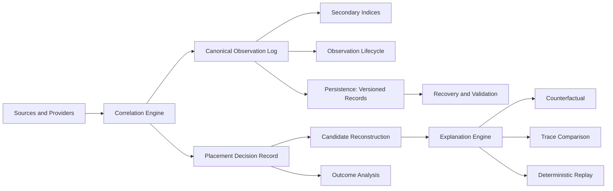

# Placement Observatory

Placement Observatory is an open-source, vendor-neutral observability runtime for
reconstructing, explaining, replaying, and comparing AI workload placement
decisions across heterogeneous compute, memory, topology, queue, capacity, and
locality constraints.

Its governing systems question is:

> Why did this work land here, what other placements were available, which
> constraints and costs drove the decision, and can that placement decision be
> reconstructed later from evidence rather than guessed from outcome?

Placement Observatory is **not** a scheduler, placement engine, generic metrics
collector, log viewer, tracing shell, topology browser, dashboard mockup,
heuristic score toy, or post-hoc visualization wrapper. It is the observability
boundary for placement behavior inside serious AI infrastructure. It does not
own execution placement decisions. It observes, records, reconstructs, explains,
compares, validates, and replays placement evidence.

## Architecture



Everything is governed by an immutable, provenance-bearing evidence model. The
distinction between **measured**, **reported**, **derived**, **estimated**, and
**unknown** is preserved for every quantity. Missing evidence is never converted
into fabricated certainty; reconstructed candidate sets are always labelled
derived and carry their source chain.

## Building

Requires C++20, Visual Studio 2022 / MSVC, CMake, and Ninja.

```powershell
tools\build.cmd Release
```

The repository builds a single static library target that downstream projects
discover with `find_package`:

```cmake
find_package(PlacementObservatory CONFIG REQUIRED)
target_link_libraries(my_app PRIVATE PlacementObservatory::PlacementObservatory)
```

An optional CUDA component
(`PlacementObservatory::PlacementObservatoryCUDA`) provides the real RTX 5090 /
Blackwell device provider (targets `sm_120`). The core library remains fully
valid CPU-only when CUDA is unavailable.

## Public API

- **Observatory** — thread-safe facade: ingestion, queries, analytics, persistence.
- **Observation model** — immutable evidence records with explicit provenance.
- **Decision record** — candidate set, constraints, cost and score components,
  selected candidate, rejection reasons, tie-break, confidence.
- **Explain / Compare / Replay / Counterfactual** — pure, deterministic engines.
- **Canonical serialization** — deterministic binary and JSON with SHA-256 digests,
  corruption and truncation rejection.
- **Persistence / Recovery** — versioned, checksummed record store with
  transactional replacement and source-generation authority.
- **Providers** — Windows host, synthetic topology, trace/file, framed TCP, and a
  real CUDA device provider.
- **Framed TCP protocol** — real multiprocess coordinator, source/worker, and
  client/driver with strict frame decoding and stale-authority rejection.

## Verification

The repository ships a dedicated test suite, an adversarial suite, a 16-thread
concurrency suite, a fixed-seed randomized/property suite, a persistence and
recovery suite, a multiprocess framed-TCP scenario, a measured benchmark suite,
15 runnable examples (including a real RTX 5090 memory-state transition proof),
and the `po` CLI. All are built with `/W4 /WX` and zero warnings.

See the documentation index below.

## Documentation

| Topic | Doc |
| --- | --- |
| Architecture | [docs/architecture.md](docs/architecture.md) |
| Observation model | [docs/observation-model.md](docs/observation-model.md) |
| Provenance | [docs/provenance.md](docs/provenance.md) |
| Decision record | [docs/decision-record.md](docs/decision-record.md) |
| Candidate reconstruction | [docs/candidate-reconstruction.md](docs/candidate-reconstruction.md) |
| Explanation | [docs/explanation.md](docs/explanation.md) |
| Counterfactuals | [docs/counterfactuals.md](docs/counterfactuals.md) |
| Replay | [docs/replay.md](docs/replay.md) |
| Timeline | [docs/timeline.md](docs/timeline.md) |
| Sources | [docs/sources.md](docs/sources.md) |
| Persistence | [docs/persistence.md](docs/persistence.md) |
| Recovery | [docs/recovery.md](docs/recovery.md) |
| Protocol | [docs/protocol.md](docs/protocol.md) |
| Validation | [docs/validation.md](docs/validation.md) |
| Benchmarks | [docs/benchmarks.md](docs/benchmarks.md) |
| Limitations | [docs/limitations.md](docs/limitations.md) |

## Examples

Run the examples after a build:

| Example | Purpose |
| --- | --- |
| ex_basic_observation | Basic placement observation from a real Windows host provider |
| ex_decision_explanation | Complete decision explanation |
| ex_partial_evidence | Partial-evidence explanation |
| ex_queue_placement | Queue-driven placement |
| ex_memory_placement | Memory-driven placement |
| ex_locality_placement | Locality-driven placement |
| ex_deadline_placement | Deadline-driven placement |
| ex_counterfactual | Counterfactual comparison (labelled derived) |
| ex_deterministic_replay | Deterministic replay and digest stability |
| ex_trace_comparison | Trace comparison |
| ex_source_restart | Source restart and generation authority |
| ex_persistence_recovery | Persistence and recovery |
| ex_conflicting_evidence | Conflicting source evidence preserved |
| ex_distributed | Framed TCP loopback |
| ex_cuda_5090 | Real RTX 5090 memory-state transition and CUDA outcome linkage |

## License

Apache License 2.0. Copyright 2026 Summon Software Labs. No telemetry transmission.